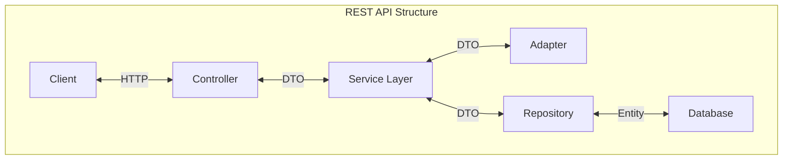

# Rest API Design

## Adapter
- Intermediaries between app components or external systems
- Converts data formats and integrates third-party services

## Controller
- Handles HTTP requests and responses
- Defines API endpoints and processes incoming data

## DTO (Data Transfer Object)
- Encapsulates data for transfer between subsystems
- Separates internal data model from external API representation

## Entity
- Represents core domain objects
- Often maps to database tables
- Contains business logic and data

## Repository
- Abstraction layer for data access
- Handles database operations (CRUD)
- Provides object-oriented view of persistence

## Service
- Contains core business logic
- Implements complex rules and workflows
- Bridges controllers and repositories

# resources
[REST API Design Best Practices Handbook](https://www.freecodecamp.org/news/rest-api-design-best-practices-build-a-rest-api/)