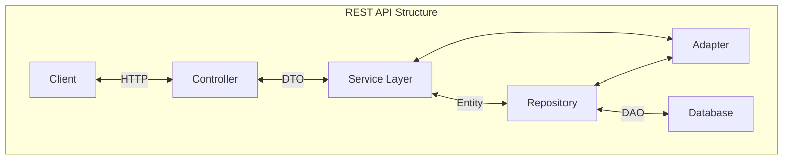

# Rest API Design

1. Client to Controller: 
   - The client sends an HTTP request to the controller.

2. Controller to Service Layer:
   - The controller processes the request, converts it into a DTO, and forwards it to the service layer.

3. Service Layer to Repository:
   - The service layer receives the DTO and applies business logic, then forwards the request to the repository.

4. Service Layer to Adapter:
   - If needed, the service layer uses the adapter for data conversion or external integrations.

5. Repository to DAO:
   - The repository uses DAOs to perform data access operations.

6. DAO to Entity:
   - DAOs use entities to interact with the database.

7. Entity to Database:
   - Entities represent the data structure and perform CRUD operations on the database.

8. Data Return Path:
   - Data flows back from the database through entities, DAOs, repositories, service layer, and controller, eventually reaching the client as an HTTP response.

# resources
[REST API Design Best Practices Handbook](https://www.freecodecamp.org/news/rest-api-design-best-practices-build-a-rest-api/)

